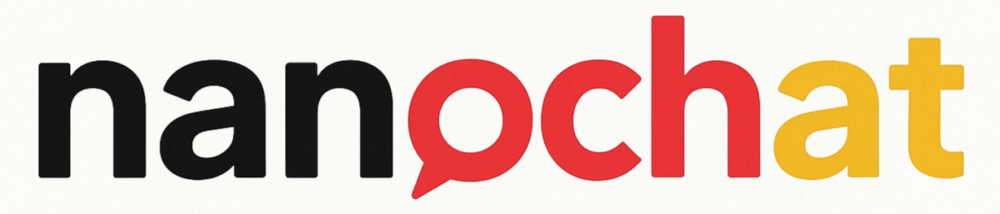

# nanochat for German



> The best German ChatGPT that $100 can buy.

First, many thanks to Andrej Karpathy for his amazing work on [nanochat](https://github.com/karpathy/nanochat) (and his numerous other [projects](https://github.com/karpathy/nanoGPT) and [videos](https://www.youtube.com/andrejkarpathy) about LLMs).

This repo is building a full-stack implementation of an LLM like ChatGPT in a single, clean, minimal, hackable, dependency-lite codebase - focused on the German language. It is designed to run on a single 8XH100 node. This includes tokenization, pretraining, finetuning, evaluation, inference, and web serving over a simple UI so that you can talk to your own LLM just like ChatGPT.

Please note that *this* implementation is not meant to be the **one** German nanochat model. Instead, it is meant to be one possible nanochat model for German! The choice of pretraining data is highly opinionated, and I plan to experiment more with other datasets, such as data from the amazing [Occiglot dataset](https://huggingface.co/datasets/occiglot/occiglot-fineweb-v1.0), [FineWeb-2](https://huggingface.co/datasets/HuggingFaceFW/fineweb-2), [Common Corpus](https://huggingface.co/datasets/PleIAs/common_corpus), [German Commons](https://huggingface.co/datasets/coral-nlp/german-commons)...

## Changelog

* 24.10.2025: [Public release](https://huggingface.co/stefan-it/nanochat-german-base) of the trained base model
* 22.10.2025: [Various fixes](https://github.com/stefan-it/nanochat-german/pull/1) for the evaluation code
* 21.10.2025: [Public release](https://huggingface.co/datasets/stefan-it/nanochat-german-eval-data) of translated evaluation datasets
* 20.10.2025: Initial version.

## Progress

Here's a quick overview of (completed) steps for training a nanochat model for German:

* [x] Dataset Construction
* [x] Tokenizer Training
* [x] Tokenizer Evaluation
* [x] [Evaluation Datasets](https://huggingface.co/datasets/stefan-it/nanochat-german-eval-data)
* [x] [Base Model Training](https://huggingface.co/stefan-it/nanochat-german-base)

Expect more updates in the upcoming days!

## Dataset

For the very first German nanochat model, we use a subset of the [LLäMmlein](https://huggingface.co/datasets/LSX-UniWue/LLaMmlein-Dataset) pretraining dataset, which itself is a strict subset of the German portion of the [RedPajama V2](https://huggingface.co/datasets/togethercomputer/RedPajama-Data-V2) dataset.

More precisely, we use the first 20 JSONL files of their dataset, merge them into a single collection, and split the data into shards containing approximately 250 million characters each.

The dataset is available on the [🤗 Model Hub](https://huggingface.co/datasets/stefan-it/nanochat-german-data).

## Tokenizer Training

A tokenizer on 2B chars is trained using Andrej's implementation and is also available in the [🤗 Model Hub](https://huggingface.co/stefan-it/nanochat-german-tokenizer).

## Tokenizer Evaluation

The original tokenizer evaluation scripts contain English examples. We did not simply "translate" these examples to German. Instead, we used proper German examples from newspaper articles, lecture notes, and theses.

## Base Model Training

The [base model](https://huggingface.co/stefan-it/nanochat-german-base) was trained using the [train_model.sh](train_model.sh) script on 8xA100 from [Lambda](https://lambda.ai/).

As I am a fan of `tmux` instead of using `screen`. the following command was used:

```bash
WANDB_RUN=nanochat-german tmux new-session -s nanochat-german -d "bash train_model.sh" \; pipe-pane -o "cat >> nanochat-german.log"
```

## Acknowledgements

- Many thanks to Andrej Karpathy's original [nanochat](https://github.com/karpathy/nanochat) repo!
- Thanks to the [LLäMmlein team](https://huggingface.co/LSX-UniWue) for making the pretraining data publicly available.

## Cite

If you find nanochat helpful in your research, please first cite the original nanochat work as:

```bibtex
@misc{nanochat,
  author = {Andrej Karpathy},
  title = {nanochat: The best ChatGPT that $100 can buy},
  year = {2025},
  publisher = {GitHub},
  url = {https://github.com/karpathy/nanochat}
}
```

For my German nanochat modifications, you can use:

```bibtex
@misc{german-nanochat,
  author = {Stefan Schweter},
  title = {nanochat german: The best German ChatGPT that $100 can buy},
  year = {2025},
  publisher = {GitHub},
  url = {https://github.com/stefan-it/nanochat-german}
}
```

But please make sure that you have at least cited Andrej's work!

## License

MIT